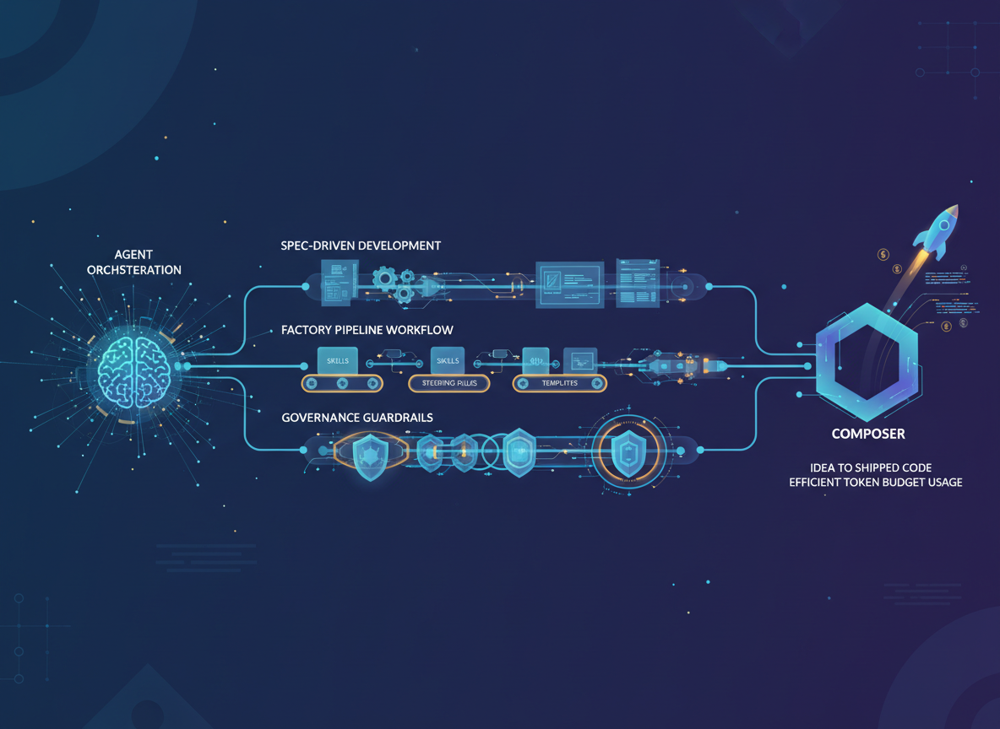

<div align="center">



# rhazen35/agent-orchestration

**A tool-agnostic agent orchestration setup for spec-driven development.**

Give your AI agent a structured, auditable factory pipeline — from vague idea to shipped code — without burning your token budget.

[](LICENSE)
[](https://packagist.org/packages/rhazen35/agent-orchestration)
[](https://www.npmjs.com/package/rhazen35-agent-orchestration)

</div>

---

## What is this?

This package provides a complete **Factory Pipeline** workflow for AI agents. It includes skills, steering rules, templates, and governance guardrails — all as plain markdown files that any agent can read, regardless of language or tooling.

No runtime code. No dependencies. Works with PHP, Go, Rust, Python, Node, or anything else.

---

## The Factory Pipeline

> Every phase is **manually triggered**. Nothing runs automatically. You stay in control, and your token budget stays intact.

```
Design → Queue → Production → Sentinel → Quality Control → Archiving
```

### 🧠 Phase 1 — Design
**Trigger:** "I want to build X" or "Start a new spec for Y"

The `spec-architect` skill orchestrates sub-skills in sequence:

| Sub-skill | What it does |
|---|---|
| `discovery` | Maps the codebase, checks cache before re-scanning |
| `mcp-orchestrator` | Discovers available MCP tools, enriches spec with live data |
| `grill-me` | Challenges assumptions, provides recommended answers |
| `acceptance-criteria-generator` | Drafts requirements and testable acceptance criteria |

**Output:** signed-off `plan/{namespace}/plan.md`
**Gate:** you must approve the plan before anything enters the inbox.

---

### 📥 Phase 2 — Queue
**Trigger:** "queue tasks" or "load inbox"

Tasks are loaded into `inbox/{namespace}/tasks.md` in **batches of max 3** (the Hydration Limit). The next batch only loads after a slot opens. A flawed plan fails fast and cheap, not after 20 API calls.

**Gate:** confirm the inbox before production starts.

---

### ⚙️ Phase 3 — Production
**Trigger:** "process next task"

The `task-processor` runs with **JIT context** — it only reads the task, the file it's editing, and `steering/principles.md`. Nothing else. Small context window, fast and cheap calls.

**Output:** task moved to `outbox/{namespace}/pending-review.md`

---

### 🛡️ Phase 3.5 — Sentinel Pre-Check
**Trigger:** runs as part of "review", before the quality reviewer

The `sentinel` catches cheap failures before they reach the expensive inspector:

- Syntax errors or lint failures
- Ghost comments (`TODO`, `FIXME`, unfinished notes)
- Changelog format errors
- Scope creep (files touched outside the task's scope)

**Fail:** task returns to `inbox/` with `[SENTINEL_FAIL]`. Quality reviewer is never called.

---

### 🔍 Phase 4 — Quality Control
**Trigger:** "review"

The `quality-reviewer` performs deep reasoning against `acceptance-criteria.md` and `steering/principles.md`. Also runs `integrity-check` for ghost features and architectural drift.

| Result | Action |
|---|---|
| ✅ Pass | Task moves to `outbox/{namespace}/completed.md` |
| ❌ Fail | Task returns to `inbox/` with `[REJECTION NOTE]` + incremented `[LOOP COUNT]` |

> If a task is rejected **4 times**, the pipeline locks. Human intervention required.

---

### 📦 Phase 5 — Archiving
**Trigger:** "archive"

The `changelog-architect` skill:
1. Appends an entry to `CHANGELOG.md` under `## [Unreleased]`
2. Appends the task + review notes to `archive/{namespace}/decision-log.md`
3. Cleans up `outbox/{namespace}/completed.md`
4. Invokes `monitor` to update `dashboard.md`

---

## Quick Reference

| Command | Phase triggered |
|---|---|
| "I want to build X" | 🧠 Phase 1: Design |
| "Queue tasks" | 📥 Phase 2: Queue |
| "Process next task" | ⚙️ Phase 3: Production |
| "Review" | 🛡️ + 🔍 Sentinel → Quality Control |
| "Archive" | 📦 Phase 5: Archiving |

---

## Installation

This package contains no runtime code — only markdown files consumed by your AI agent. It works with any language or stack.

### PHP — Composer

```bash
composer require rhazen35/agent-orchestration
```

Copy the directories into your project root:

```bash
cp -r vendor/rhazen35/agent-orchestration/skills ./skills
cp -r vendor/rhazen35/agent-orchestration/steering ./steering
cp -r vendor/rhazen35/agent-orchestration/templates ./templates
cp -r vendor/rhazen35/agent-orchestration/records ./records
```

### Node — npm

```bash
npm install rhazen35-agent-orchestration
```

```bash
cp -r node_modules/rhazen35-agent-orchestration/skills ./skills
cp -r node_modules/rhazen35-agent-orchestration/steering ./steering
cp -r node_modules/rhazen35-agent-orchestration/templates ./templates
cp -r node_modules/rhazen35-agent-orchestration/records ./records
```

### Go, Rust, Python, or any other language — Git Submodule

```bash
git submodule add https://github.com/rhazen35/agent-orchestration .agent
```

Point your agent tooling at `.agent/steering/`, `.agent/skills/`, etc.

Update to the latest version:

```bash
git submodule update --remote .agent
```

Clone a project that uses this as a submodule:

```bash
git clone --recurse-submodules <your-repo-url>
```

### Quick Start (no package manager)

```bash
git clone https://github.com/rhazen35/agent-orchestration .agent
```

---

## Namespacing

Every specification gets its own namespace folder — a short kebab-case name applied consistently across all directories.

| Directory | Namespaced path |
|---|---|
| Specification | `specification/{namespace}/` |
| Plan | `plan/{namespace}/` |
| Inbox | `inbox/{namespace}/tasks.md` |
| Outbox | `outbox/{namespace}/` |
| Records | `records/{namespace}/` |
| Archive | `archive/{namespace}/` |

---

## Governance

`steering/governance.md` defines hard limits no agent can override:

| Rule | Limit |
|---|---|
| Inbox hydration | Max 3 active tasks at once |
| Loop limit | Task rejected 4 times → pipeline locks |
| Token budget | 50,000 tokens per run → Soft Halt |
| Cooldown | 5 consecutive completions → wait for "Continue" |
| Discovery cache | Never re-scan if fingerprint is current |
| JIT context | Worker reads only what it needs |

---

## Dashboard

`dashboard.md` is the control tower. Check it before starting any work.

| Status | Meaning |
|---|---|
| 🟢 OPERATIONAL | All clear |
| 🟡 THROTTLED | Wait for human `[CONTINUE]` |
| 🔴 CIRCUIT BREAKER TRIPPED | Do not start work — human reset required |

---

## Skills Reference

| Skill | Purpose |
|---|---|
| `spec-architect` | End-to-end spec creation |
| `discovery` | Codebase mapping with caching |
| `mcp-orchestrator` | Dynamic MCP tool discovery and data enrichment |
| `grill-me` | Assumption stress-testing |
| `acceptance-criteria-generator` | Requirements → testable criteria |
| `task-processor` | JIT task implementation |
| `sentinel` | Cheap pre-check before review |
| `quality-reviewer` | Deep spec + principle review |
| `integrity-check` | Drift and ghost feature detection |
| `changelog-architect` | Task archiving and changelog |
| `monitor` | Dashboard updates |

---

## Steering Files

Always loaded into every agent context:

| File | Purpose |
|---|---|
| `steering/principles.md` | Core architectural constraints |
| `steering/governance.md` | Hard resource and loop limits |
| `steering/audit-requirements.md` | Requirement changes must be logged and ADR'd |
| `steering/workflow.md` | Full pipeline reference |

---

## MCP Integration

This package is designed to work with [Model Context Protocol (MCP)](https://modelcontextprotocol.io) servers out of the box. MCP tools extend the agent's capabilities beyond local file editing — enabling live database inspection, web search, API fetching, and more.

### How it works

The agent does not hardcode any MCP servers. Instead, it performs a **handshake** at session start:

1. Agent calls `list_tools` to discover what the host environment provides.
2. Agent matches the returned tool schemas against `steering/mcp-policy.md`.
3. Authorized tools are used purposefully — local files always take precedence.

### Capability Requirements

The factory expects the host to provide tools for these capabilities:

| Capability | Used for | Fallback |
|---|---|---|
| Search | Verify library versions, docs | Ask human |
| Filesystem | Read/write specs and inbox | Local agent tools |
| Runtime | Run tests and linting (Sentinel) | Manual checks |
| Database | Inspect live schemas | Use spec definitions |
| Version Control | Read issues, PRs, commit history | Use `records/` and `archive/` |

If a capability is missing, the pipeline continues — it never blocks on absent tools.

### Tool Selection Priority

When multiple tools fulfill the same capability, the agent picks in this order:

1. Local filesystem tools (lowest cost)
2. Specialized local servers (e.g., local Postgres, SQLite)
3. Remote API servers (e.g., GitHub, Brave Search, Slack)

### The Local-First Rule

Before calling any MCP tool, the agent must check:

1. `specification/{namespace}/` — does the spec already answer this?
2. `archive/mcp-data/{namespace}/` — has this tool been called and cached?
3. `cache/discovery-report.md` — is this covered by the last discovery run?

Only if all three are empty or stale does the agent proceed with a tool call. Tool outputs are persisted to `archive/mcp-data/` so the worker never re-calls a tool for the same data.

### MCP in the Pipeline

| Phase | MCP usage |
|---|---|
| Phase 1: Design | `mcp-orchestrator` runs full capability mapping, enriches spec with live data |
| Phase 3: Production | `task-processor` invokes `mcp-orchestrator` in lightweight mode for specific data needs |
| Phase 3.5: Sentinel | Uses runtime tools (linter, test runner) if available |

### Relevant Files

| File | Purpose |
|---|---|
| `steering/mcp-policy.md` | Capability requirements, tool selection logic, authorization rules |
| `steering/mcp-governance.md` | Hard limits: context budget, write safety, failure fallback |
| `steering/mcp-etiquette.md` | Local-First rule, purposeful tool use, no spec overwrites |
| `skills/mcp-orchestrator.md` | The bridge skill — discovery, justification, execution, sentinel filter |
| `archive/mcp-data/` | Persisted tool outputs, reused across tasks |

---

## Customizing for Your Project

Every skill, steering file, and template can be overridden at the project level without touching the package files. The agent checks `.agent/` first before falling back to the package defaults.

```
your-project/
  .agent/
    skills/
      quality-reviewer.md     ← overrides the default
      sentinel.md             ← overrides the default
    steering/
      principles.md           ← overrides the default
    templates/
      plan/
        plan-template.md      ← overrides the default
```

To extend rather than replace, start your override file with:

```markdown
# [Skill Name] — Project Extension

> Extends the base skill. All base behavior applies unless explicitly overridden below.

## Project-Specific Additions

...your additions here...
```

Two files should never be overridden: `steering/workflow.md` (the pipeline contract) and `steering/overrides.md` (the override system itself).

See `steering/overrides.md` for the full resolution order, a complete list of overridable files, and guidance on what to override with caution.

---

## License

MIT — see [LICENSE](LICENSE).
